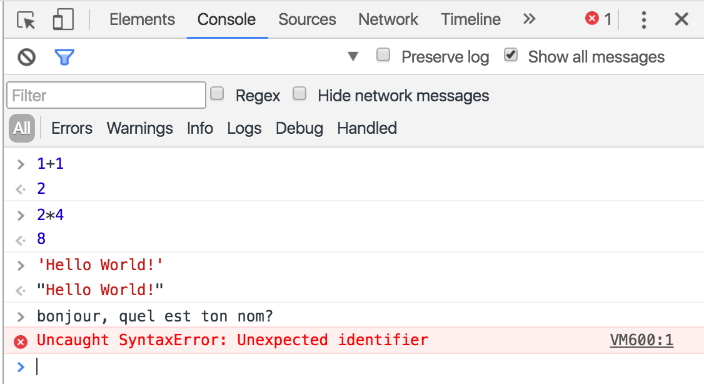

# Chapitre 1: Les bases

---

> Conseil pratique: pour naviguer dans ce cours, vous pouvez y rechercher un mot (ex: "exercice") en pressant `Ctrl-F` ou `Cmd-F`. Utilisez la table des matières pour passer d'un chapitre à l'autre.

## Introduction à la Programmation et à JavaScript

### Langage de programmation

JavaScript est un langage qui permet de donner des ordres (appelés *instructions*) à une machine.

La machine en question peut être:

- un navigateur web
- un ordinateur
- un serveur sur internet
- un objet intelligent (ex: Arduino, Raspberry Pi...)
- voire même une carte à puce ! (ex: carte SIM, carte bleue...)

On va donc apprendre des commandes et structures pour expliquer ce qu'on attend de cette machine.

### Qu'est-ce qu'un programme ?

Le code source d'un programme est un peu comme une recette de cuisine: on y définit une liste d'actions (les *instructions*) qui permettent à quiconque de reproduire le plat, autant de fois qu'il le veut.


Comme dans une recette, si votre code source est trop vague ou contient des erreurs, le résultat risque d'être décevant, voire complètement à côté de la plaque.

Contrairement à une recette de cuisine, il faut garder en tête que ce n'est pas un humain qui va interpréter votre code source, mais une machine. Sachant que, contrairement à un humain, une machine n'est pas capable de raisonner intuitivement, il faut être extrêmement rigoureux dans le respect des règles de grammaire et d'orthographe du langage.


Si vous écrivez votre code de manière approximative, deux choses peuvent se passer:

- si vous avez de la chance, la machine vous avertira qu'elle n'a pas compris une de vos instructions => elle affichera un message d'erreur pour vous aider à la corriger;
- soit, dans certains cas, il ne se passera rien de visible. Dans ce cas, ce sera à vous de relire votre code, et de vous mettre à la place de la machine pour essayer de comprendre comment elle l'interprète.

### Histoire du langage JavaScript

JavaScript a été créé en 1995, pour le compte de la société Netscape (éditeur d'un des premiers navigateurs web, dont Mozilla Firefox est l'héritier), puis standardisé sous le nom d'ECMAScript (souvent réduit à ses initiales "ES").


Utilisable sur de nombreuses plate-formes, JavaScript est le seul langage de programmation inclus en standard dans les navigateurs web. On dit donc que c'est "le langage du web".


> Même si le nom ressemble, Java est un langage différent de JavaScript. Si vous avez la flemme de prononcer "JavaScript", utilisez donc ses initiales "JS" plutôt que "Java".

Malgré ses nombreuses évolutions, JavaScript est plutôt un langage de script qu'un langage de programmation, à proprement parler. En effet, il a été conçu comme une solution simple pour ajouter des interactions aux pages HTML du web, et non pour créer des logiciels à haut niveau de sûreté. Une des conséquences: c'est un langage faiblement typé. Nous allons voir ça plus bas.


### Exécution de code JavaScript

Il y a deux façons d'exécuter nos instructions JavaScript:

1. de manière interactive: via une console
2. de manière programmative: en rédigeant un code source

Dans le premier cas, chaque instruction sera exécutée immédiatement puis retournera un résultat, comme sur une calculatrice.


Dans le deuxième cas, on va écrire une liste d'instructions dans un fichier (appelé "code source"), pour que notre machine puisse exécuter ce fichier en une seule fois.

Pour tester JavaScript en mode interactif:
- Ouvrez une fenêtre de navigation privée (mode incognito) depuis Google Chrome,
- ouvrez la console JavaScript en utilisant le raccourci clavier `Cmd`+`Alt`+`J` (sur Mac) ou `Ctrl`+`Shift`+`J` (sur PC/Window)
- tapez `1+1` et validez. => La console devrait afficher le résultat de cette opération. Ensuite tapez `alert('bonjour');` et observez ce qui se passe.



> Il existe de nombreuses consoles JavaScript plus ou moins évoluées: [repl.it](https://repl.it/languages/javascript), [glot.io](https://glot.io/new/javascript), [jsbin](https://jsbin.com/?js,console), [jsfiddle](https://jsfiddle.net/), et [codepen](https://codepen.io/) permettent d'éditer son code de manière un peu plus confortable mais ne conservent pas d'historique de vos instructions, contrairement à la console de Google Chrome.

## Manipulation de valeurs

### Types de valeurs

En langue Française, il existe plusieurs types de mots: les noms, les verbes, les adjectifs, les prénoms, etc...

De la même façon, en maths, on peut manipuler plusieurs types de valeurs: nombres entiers, décimaux, rationnels (fractions), complexes, etc...

En JavaScript, c'est pareil. Il est possible d'exprimer et de manipuler des valeurs de différents types.

#### Types simples

+ booléen (*boolean*): `true`, `false`
+ nombre (*integer/float number*): `999`, `0.12`, `-9.99`
+ chaîne de caractères (*string*): `'coucou'`
+ aucune valeur: `null`

#### Types avancés

+ non défini: `undefined`
+ objet (*object*): `{ prop: 'valeur' }`
+ tableau (*array*): `[ 1, 2, 3 ]`
+ fonction (*function*): `function(){ /* ... */ }`

#### Exercice: Quel type ?

1) Reconnaissez les types des valeurs ci-dessous.
Notez que:
- certaines lignes contiennent plusieurs valeurs;
- quand une ligne contient une opération, devinez la valeur et le type du résultat de cette opération.

2) Vérifiez vos réponses en saisissant ces opérations dans la console, et en utilisant le mot clé `typeof`. (voir plus bas)

```js
0
true
2 - 1.2
'hello'
'bonjour' + 4
{ a: 0.4 }
[ 'a', 'b', 'c' ]
```

> Le mot clé `typeof` renvoie le type de l'expression qui suit.

> <a href="1-solutions/1-quel-type.js" target="_blank">Solution</a>

3) Expliquez le type de la dernière ligne.

### Variables et opérateur d'affectation

#### Variables et valeurs littérales

Dans l'exercice ci-dessus, nous avons manipulé des valeurs de manière **littérale**. C'est à dire qu'elles étaient explicitement affichées dans le code.

Dans un véritable programme, les valeurs dépendent souvent d'une saisie de l'utilisateur, ou d'autre chose. Du coup, elles sont rarement exprimées de manière littérale. On utilise pour ça une représentation symbolique: **les variables**.

En maths, on représente habituellement une variable sous forme d'une lettre minuscule. Par exemple "*soit x=4*" veut dire qu'on définit une variable appelée `x` représente actuellement la valeur `4`. (un nombre entier, en l'occurrence)

En JavaScript, une variable représentée par une suite de lettres (minuscules et/ou majuscules) pouvant contenir aussi des chiffres et le symbole *underscore* (`_`).

Généralement, on emploie une notation appelée **camel case** pour nommer les variables en JavaScript. Cette notation consiste à coller plusieurs mots, en mettant en majuscule seulement la première lettre de chaque mot, sauf celle du premier mot.

Exemple: `nombreSaisiParUtilisateur` est un bon nom pour une variable JavaScript.

> *Camel* veut dire "chameau", en Français. Avez-vous compris pourquoi ?

#### Opérateur d'affectation

Comme en maths, l'opérateur d'affectation `=` permet d'affecter une valeur (à droite) à une variable (à gauche).

> Par exemple, si on tape `monNombre=1` dans une console JavaScript, puis qu'on y tape `monNombre`, la console nous répondra `1` car c'est la valeur actuelle de la variable `monNombre`.

Chaque usage de l'opérateur d'affectation sur une variable **changera sa valeur actuelle**, quitte à remplacer la valeur qu'elle portait précédemment.

> Par exemple, si on tape `monNombre=1`, `monNombre=2` puis `monNombre`, la console JavaScript nous répondra `2` car c'est la dernière valeur qui a été affectée à la variable `monNombre`.

La valeur affectée (à droite du `=`) peut être une valeur **littérale**, ou celle d'une **autre variable**.

> Par exemple, si on tape `autreNombre=monNombre`, puis `autreNombre`, la console JavaScript nous répondra `2` car nous avons affecté la valeur de la variable `monNombre` (`2`, tel qu'affecté dans l'exemple précédent) à notre nouvelle variable `autreNombre`.

À noter que l'opérateur d'affectation se comporte différemment selon que la valeur affectée est de **type simple** (nombre, chaîne de caractères...) ou **avancé** (objet, tableau, fonction...):

- l'affectation d'une valeur de type simple **dupliquera** cette valeur dans la variable affectée;
- alors qu'en affectant une valeur de type avancé, notre variable affectée sera en fait une **référence** à cette valeur.

Exemple d'affectation de valeur de type simple:

```js
maValeurSimple=1
autreValeurSimple=maValeurSimple
// à ce stade, nos deux variables valent 1
maValeurSimple=2
// => autreValeurSimple vaut toujours 1, alors que maValeurSimple vaut 2
```

Exemple d'affectation de valeur de type avancé:

```js
monTableau=[1,2,3]
autreVariable=monTableau
// à ce stade, nos deux variables valent [1,2,3]
monTableau=[4,5,6]
// cette instruction a affecté un autre tableau à monTableau
// => autreValeurSimple vaut toujours [1,2,3], car il référence toujours le tableau qui lui avait été affecté
```

Exemple d'affectation de valeur de type avancé, **avec modification**:

```js
monTableau=[9,8,7]
autreVariable=monTableau
// à ce stade, nos deux variables valent [9,8,7]
monTableau.sort()
// cette instruction a rangé notre tableau dans l'ordre croissant
// => monTableau vaut désormais [7,8,9]
// => ... et autreVariable vaut aussi [7,8,9], car la tableau qu'il référencé a été modifié.
```

#### Création de variable

Dans nos exemples, les variables ont été créées automatiquement par la console JavaScript lors de leur première affectation de valeur.

Mais nous allons désormais créer nos variables de manière explicite, à l'aide du **mot-clé `var`**.

En effet, l'usage de `var` permet de s'assurer qu'on a pas déjà créé une variable du même nom.

Il est possible **d'affecter une valeur** à notre variable lors de sa création avec `var`.

Il restera évidemment possible d'affecter d'autres valeurs à notre variable, à l'aide de l'opérateur d'affectation, mais sans utiliser `var` ensuite.

Exemple:

```js
// on va crééer une variable de type chaîne de caractères:
var maVariable = 'mon texte';
// => maVariable vaut 'mon texte'
maVariable = `mon nouveau texte`;
// => maVariable vaut désormais 'mon nouveau texte'
```

Vous remarquerez que:
- j'ai ajouté des **espaces** autour de l'opérateur d'affectation pour améliorer la lisibilité de mon code;
- et j'ai terminé mes instructions par un **point-virgule** (`;`).

Afin d'améliorer la lisibilité de votre code, et d'éviter tout ambiguïté pouvant occasionner des erreurs, je compte sur vous pour appliquer ces règles.

#### Exercice: Création de variables

En utilisant la console JavaScript:

1) Créez les variables suivantes:

- la variable `monNombre` avec une valeur de `4`,
- la variable `maChaine` contenant `'bonjour ! :-)'`,
- la variable `monBooleen` valant `false`,
- et une variable `sansValeur` à laquelle vous n'aurez affecté aucune valeur.

2) Pour confirmer que vos variables sont correctes, vérifiez que chaque instruction ci-dessous répond `true`: (copiez-collez-les une par une dans la console)

```js
monNombre === 4;
maChaine === 'bonjour ! :-)';
monBooleen === false;
sansValeur === undefined;
```

## Comparaisons de valeurs et conditions

Un programme est sensé pouvoir prendre des décisions de manière autonome, sur la base de conditions.

Pour exprimer ces conditions, on s'appuie généralement sur des comparaisons entre valeurs. Nous allons commencer par la comparaison la plus simple: **l'égalité de valeurs**.

### Comparaison d'égalité: `==` et `===`

En JavaScript il existe deux opérateurs de comparaison d'égalité:

- `==` vérifie l'égalité de deux valeurs de manière laxiste;
- `===` vérifie l'égalité de deux valeurs de manière stricte.

Une **égalité laxiste** consiste à dire que deux valeurs sont vues comme équivalentes, mais pas exactement égales.

> Exemple: `1` (nombre) et `"1"` (chaîne de caractères) représentent tous les deux le chiffre `1`, mais sont de types différents => ils sont égaux seulement selon l'opérateur d'égalité laxiste.

L'**égalité stricte** vérifie en plus que le type des deux valeurs comparées est le même.

Quelques exemples:

```js
1 == '1'; // => true
1 === `1`; // => false (car types différents)

0 == false; // => true
0 === false; // => false

null == undefined; // => true
null === undefined; // => false
```

La comparaison entre **valeurs de types avancés** fonctionne différemment. Ce ne sont pas les valeurs à proprement parler qui sont comparées, mais la référence vers cette valeur.

Explication:

```js
[1,2] == [1,2]; // => false, car deux tableaux ont été créés

var monTab = [1,2];
monTab == monTab; // => true, car la variable monTab référence un seul et même tableau

monTab == [1,2]; // => false, car ce sont deux références de tableaux différents

var monTab2 = monTab;
monTab == monTab2; // => true, car monTab2 fait référence au même tableau que monTab
```

**ATTENTION !**

Notez que les opérateurs de comparaison d'égalité `==` et `===` ne doivent pas être confondus avec l'opérateur d'affectation `=`.

Vous verrez plus tard que se tromper d'opérateur peut causer des erreurs silencieuses qui peuvent mettre des heures à être détectées et corrigées dans votre code !

Donc soyez attentifs à bien les différencier quand vous écrivez votre code.

### Opérateurs d'inégalité

Quand on sait que deux valeurs ne sont pas égales, notre programme peut s'adapter à différents cas de figure.

Nous avons vu que les opérateurs `===` et `==` permettaient d'évaluer l'égalité (stricte ou laxiste), en retournant une valeur `true` quand c'était le cas. Le langage JavaScript fournit aussi leurs **opérateurs contraires**: `!==` et `!=` (strict, et laxiste, respectivement). Ceux-ci retournent une valeur `true` quand les valeurs comparées ne sont pas égales.

Exemples:

```js
1 == 1; // => true
1 === 1; // => true
1 == '1'; // => true
1 === '1'; // => false

1 != 1; // => false
1 !== 1; // => false
1 != '1'; // => false
1 !== '1'; // => true
```

Le langage JavaScript fournit aussi les opérateurs de comparaison suivants:

- strictement inférieur: `<`,
- strictement supérieur: `>`,
- inférieur ou égal: `<=`,
- supérieur ou égal: `>=`.

Exemples:

```js
1 < 1; // => false
1 > 1; // => false
1 <= 1; // => true
1 >= 1; // => true

1 < 2; // => true
1 > 2; // => false
1 <= 2; // => true
1 >= 2; // => false
```

### Conditions

Dans un programme (codé en langage JavaScript ou pas), les conditions sont une des instructions les plus incontournables.

C'est grâce aux conditions que votre programme peut prendre des **décisions** et donc d'effectuer des actions de manière autonome (ou automatique), en fonction des données qui lui sont fournies.

On peut représenter ces décisions sous forme d'un arbre:


Cet exemple d'arbre illustre un diagnostic médical, en fonction des symptômes.

Cet arbre pourrait être traduit en pseudo-code de la manière suivante:

- `si` *douleur à abdomen*, `alors` **appendicite**
- `sinon, si` *douleur à la gorge* `et`:
  - `si` *fièvre*, `alors` **rhume**
  - `sinon`, **mal de gorge**
  -
- `sinon, si`...

Puis être implémenté en langage JavaScript de la manière suivante:

```js
// supposons que les variables douleur et fievre soient fournies
var diag;
if (douleur === 'abdomen') {
    diag = 'appendicite';
} else if (douleur === 'gorge') {
    if (fievre === true) {
        diag = 'rhume';
    } else {
        diag = 'mal de gorge';
    }
}
```

En JavaScript, les conditions s'expriment à l'aide des mots-clés `if` et `else`. On les emploie de la manière suivante:

```js
if (expression) {
    // si expression == true, alors les instructions entre ces accolades vont s'exécuter
} else {
    // sinon, ce sont les instructions entre ces accolades là qui vont s'exécuter
}
```

Le mot-clé `else` (facultatif) permet d'exécuter une séquence d'instructions seulement si `expression` n'est pas vraie.

Vous pouvez utiliser une comparaison en guise d'`expression`.

Exemple:

```js
var monNombre = 1, resultat;
if (monNombre === 1) {
    resultat = 'monNombre vaut 1';
} else {
    resultat = 'monNombre ne vaut pas 1';
}
resultat;
// => cette liste d'instructions va afficher 'monNombre vaut 1'
```

> A retenir: dans un bloc `if-else`, soit les instructions entre la première paire d'accolades sera exécuté, soit celles de la deuxième paire d'accolades.
> 
> Par ailleurs, observez bien la manière d'agencer les accolades et les espaces.

### Condition avec multiples alternatives

Dans le cas où vous aimeriez définir plus de deux comportements alternatifs, vous pouvez employer ajouter des cas `else if()` entre votre bloc `if{}` et votre bloc `else{}`.

Exemple:

```js
if (monNombre === 1) {
    resultat = 'monNombre vaut 1';
} else if (monNombre > 1) {
    resultat = 'monNombre est supérieur à 1';
} else {
    resultat = 'monNombre n\'est ni égal à 1, ni supérieur à 1';
}
resultat;
```

Comme pour les blocs `if-else`, seules les instructions d'**une** paire d'accolades seront exécutées.

Par contre, si vous écrivez plusieurs blocs `if-else` à la suite les uns des autres, ceux-ci seront complètement indépendants.

### Instructions pour interagir avec l'utilisateur: `prompt` et `alert`

Maintenant qu'on a vu comment faire un sorte qu'un programme prenne des décisions, il faut qu'on soit capable d'interagir avec lui.

A ce stade, nous allons employer deux instructions pour cela:
- `alert` permet d'afficher un message à l'utilisateur;
- et `prompt` permet de lui demander de saisir une chaîne de caractères.

Par exemple, voici comment **afficher** `Bonjour !`:

```js
alert('Bonjour !');
```

> Comme vous le voyez, il faut fournir le message à afficher entre parenthèses. Et, comme il s'agit ici d'une chaîne de caractères littérale, il ne faut pas oublier de mettre le texte entre apostrophes.

Il est aussi possible d'afficher la valeur d'une variable:

```js
var monMessage = 'Hello !';
alert(monMessage); // usage d'une variable => pas d'apostrophes
```

Maintenant, voici comment **inviter l'utilisateur à saisir** une chaîne de caractères, puis l'afficher:

```js
var sonPrenom = prompt('Quel est ton prénom ?');
alert('Bonjour, ' + sonPrenom + ' ! :-)');
```

> Êtes vous capable d'interpréter ce que signifie le code à l'intérieur des parenthèses du `alert` ? On appelle ça "la concaténation". On verra ça plus en détail dans les cours à venir.

### Exercice 1: Chat-bot bête mais poli

Écrivez et testez un programme qui va inviter l'utilisateur à saisir une phrase, et se comporter différemment selon sa saisie:
- si l'utilisateur saisit `bonjour`, afficher `Bonjour à toi !`;
- sinon, si l'utilisateur saisit `tu vas bien ?`, afficher `Bien, et toi ?`;
- et sinon, afficher `Désolé, je n'ai pas compris...`.

### Exercice 2: Chat-bot poli mais pas sympa

Écrivez un autre programme sur la base du précédent.

Dans le cas où l'utilisateur aura saisi `bonjour`, le programme affichera `Bonjour ! Ca va ?`, invitera l'utilisateur à saisir une deuxième réponse puis se comportera différemment selon cette deuxième réponse:
- si l'utilisateur saisit `oui`, afficher `Je suis content pour toi.`;
- sinon, afficher `Désolé, il faut que je file.`.

### Exercice 3: Votre propre chat-bot

À vous de concevoir et implémenter votre propre chat-bot !

Vous allez devoir produire et rendre deux fichiers:
1. Dessiner un arbre représentant un total de 5 questions qui pourront être posées par votre chat-bot, ainsi que les réponses associées pour chaque cas. L'arbre doit avoir au moins 2 niveaux de profondeur (c.a.d. degré 2).
2. Implémenter et tester les lignes de code JavaScript permettant d’interagir avec le chat-bot, tel que défini par votre arbre.

Vous devrez utiliser les mots clés: `var`, `if`, `else`, `=`, `===`, `prompt` et `alert`.

### Exercice bonus: Chat-bot sur Messenger

Si vous avez trouvé les exercices trop faciles, et que vous avez aidé vos camarades, je vous propose un défi un peu plus compliqué: faire de votre programme un véritable chat-bot joignable via Messenger.

Pour cela, je vous recommande d'utiliser une plate-forme de développement de chat-bot, ou de partir d'un exemple. (ex: https://bottr.co/)

### Combinaison d'expressions conditionnelles `&&` et `||`

Dans l'exemple précédent, on a vu que chaque alternative dépendait du résultat d'une seule expression de comparaison de valeurs.

```js
if (maPremiereValeur === maDeuxiemeValeur) { /* ... */
} else if (maPremiereValeur > maDeuxiemeValeur) { /* ... */ }
```

Dans certains cas, une alternative est définie par la combinaison de plusieurs expressions.

Par exemple, imaginons un programme qui propose comment s'habiller en fonction du temps qu'il fait, en suivant les critères suivants:

- S'il fait beau et chaud, suggérer de porter un short,
- S'il pleut ET qu'il fait chaud, suggérer de prendre un parapluie,
- S'il pleut ET qu'il fait froid, suggérer de prendre un manteau à capuche.

Sachant qu'il est possible d'imbriquer des conditions, on pourrait l'implémenter de la manière suivante:

```js
if (temps === 'beau') {
    suggestion = 'short';
} else if (temps === 'pluie') {
    if (temperature >= 20) {
        suggestion = 'parapluie';
    } else if (temperature < 20) {
        suggestion = 'manteau à capuche';
    }
}
```

Mais il est aussi possible d'exprimer nos critères de manière plus linéaire, en combinant les conditions à l'aide de l'opérateur `&&`:

```js
if (temps === 'beau') {
    suggestion = 'short';
} else if (temps === 'pluie' && temperature >= 20) {
    suggestion = 'parapluie';
} else if (temps === 'pluie' && temperature < 20) {
    suggestion = 'manteau à capuche';
}
```

Dans cette implémentation, nous avons combiné les critères de `temps` et de `temperature` dans une même expression conditionnelle.

Lorsqu'une alternative `if/else` est définie par plusieurs expressions liées par l'opérateur `&&` (appelé **et**), il faut que *toutes* ces expressions soient vraies afin que les instructions associées à cette alternative soient exécutées.

Il existe aussi un opérateur `||` (appelé **ou**) qui permet de définir des alternatives qui seront exécutées si *au moins une* des expressions est vraie.

Exemple:

```js
if (rdvPrevu === true || envieDallerAuxToilettes === true) {
    message = 'excusez-moi, je vais devoir vous laisser';
} else {
    message = 'nous pouvons en discuter tout de suite, si vous voulez !';
}
```

... ce qui pourrait aussi s'écrire ainsi, sous sa forme développée:

```js
if (rdvPrevu === true) {
    message = 'excusez-moi, je vais devoir vous laisser';
} else if (envieDallerAuxToilettes === true) {
    message = 'excusez-moi, je vais devoir vous laisser';
} else {
    message = 'nous pouvons en discuter tout de suite, si vous voulez !';
}
```

Dans ce cas, nous voyons que la combinaison d'expression conditionnelle avec `||` permet de réduire la redondance de notre code, en ne définissant qu'une seule fois une même liste d'instructions correspondante à deux cas alternatifs.
