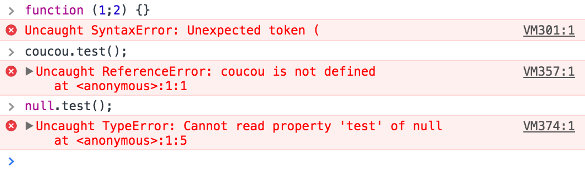
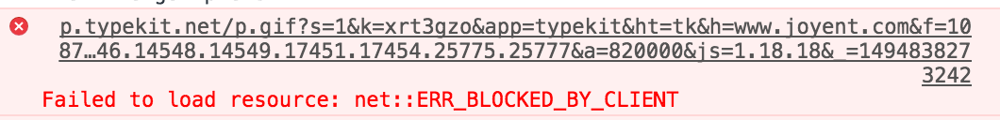
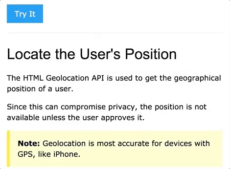

# Chapitre 11: Gestion d'erreurs et Geolocation API

Objectifs:

- Prévoir un intercepter les cas d'erreurs
- Application: détecter la position géographique de l'utilisateur

Consulter les <a href="./slides/17-error/index.html" target="_blank">slides du TP</a>.

Références:

- [Error Handling in Node.js](https://www.joyent.com/node-js/production/design/errors)
- [Utiliser la Géolocalisation](https://developer.mozilla.org/fr/docs/Using_geolocation)
- [Google Maps API pour le Web](https://developers.google.com/maps/web/)
- Démo et exemple: [HTML5 Geolocation](https://www.w3schools.com/html/html5_geolocation.asp)

---

## Gestion d'erreurs en JavaScript

Dans un programme informatique comme dans la vie, tout ne se passe pas toujours comme prévu !

Dans ce chapitre, nous allons découvrir les différents types d'erreurs qui peuvent survenir dans un programme JavaScript, et comment les gérer dans notre code.

### Erreurs synchrones et asynchrones

Avant de catégoriser les différents type d'erreurs, définissons la différence entre du code synchrone et asynchrone.

Une instruction synchrone est dite "bloquante". C'est à dire que l'instruction suivante sera exécutée seulement une fois que l'opération invoquée par cette instruction aura fini de s’exécuter.

Exemple:

```js
// alert() est une fonction synchrone car:
alert('cliquez sur OK'); // exécution du programme bloquée jusqu'au clic de l'utilisateur
console.log('bonjour !');
// bonjour sera affiché dans la console seulement une fois que l'utilisateur aura cliqué
```

Une instruction asynchrone est dite "non bloquante". C'est à dire qu'elle d’éclanche une opération qui va se dérouler en arrière plan, pendant que les instructions suivantes du programme vont être exécutées.

Conséquence importante: le résultat de l’exécution d'une instruction asynchrone n'était pas disponible immédiatement, il va falloir définir et fournir un fonction qui sera appelée à la fin de l'opération asynchrone correspondante.

Exemple:

```js
function direBonjour() {
  console.log('bonjour !');
}
setTimeout(direBonjour, 1000);
console.log('salut !');
// => salut va s'afficher avant bonjour, car setTimeout() est une fonction asynchrone.
```

Généralement, une instruction asynchrone consiste à appeler une fonction, en passant une autre fonction de *callback* en paramètre. Cette fonction de *callback* sera appelée à la fin de l'opération asynchrone, et un résultat sera passé en paramètre de cette fonction.

Le résultat passé en paramètre de la fonction de *callback* peut être une valeur résultante de l'opération (équivalent à l'usage de l'instruction `return`, dans le cas d'une fonction synchrone) ou une description de l'erreur qui serait éventuellement survenue pendant cette opération. (équivalent à l'usage de l'instruction `throw`, dans le cas d'une fonction synchrone)

On peut alors discerner quatre types d'erreurs:

| Synchrone                                       | Asynchrone                                             |
|-------------------------------------------------|--------------------------------------------------------|
| Erreur de programmation immédiate               | Erreur de programmation tardive                        |
| Erreur opérationnelle gérable par `try`-`catch` | Erreur opérationnelle gérable par fonction de callback |

### Erreurs de programmation

Avez-vu déjà vu ce type d'erreurs dans la console JavaScript de votre navigateur ?



Les erreurs de programmation sont causées par le développeur du programme. Souvent par inattention, ou cas non prévus.

Exemples d'erreurs de programmation:

- erreur de syntaxe. ex: il manque une accolade fermante
- usage d'un symbole non défini: variable ou instruction mal orthographiée
- usage d'une propriété ou méthode d'un objet non défini (`undefined`)
- non respect du type d'un paramètre de fonction
- fonction de callback non passée en paramètre de l'appel d'une fonction asynchrone


Quand une erreur survient dans un programme JavaScript s’exécutant dans un navigateur web, ce dernier arrête l’exécution de ce programme et affiche l'erreur dans la console, afin que le développeur puisse corriger son programme.

Les erreurs de ce type peuvent être corrigées en relisant attentivement le code (ex: localiser les paires de parenthèses et accolades), et en exécutant des tests couvrant un maximum de cas limites (ex: que se passe-t-il si l'utilisateur clique sur le bouton "annuler" au lieu de fournir la valeur demandée ?).

### Erreurs opérationnelles

Une erreur opérationnelle n'est pas directement causée par le développeur du programme. Elle peut survenir dans des cas en dehors de son contrôle.



Exemples d'erreurs opérationnelles:

- le serveur auquel une requête AJAX a été envoyée met trop de temps à répondre
- le paramètre passé à `JSON.parse()` n'est pas un objet JSON valide
- le navigateur de l'utilisateur a empêché le pop-up de s'ouvrir
- l'utilisateur a désactivé le stockage de cookies, ou la localisation
- l'utilisateur n'est plus connecté à internet
- le système est à cours de mémoire

Ce type d'erreurs arrive généralement de manière imprévue, et peut nuire gravement à l'expérience de l'utilisateur si votre programme ne les gère pas correctement. En effet, comme pour les erreurs de programmation, le navigateur interrompra l’exécution de votre programme si une de ces erreurs survient et que votre programme ne décrit pas comment les gérer.

L'interception d'une erreur opérationnelle dépend de la nature de l'instruction qui a l'a indirectement causée: synchrone ou asynchrone.

#### Cas synchrone

Dans le cas d'une opération synchrone, il suffit de contenir l'instruction pouvant causer une erreur à l’intérieur d'un bloc `try`-`catch`.

Par exemple, la fonction `JSON.parse()` est synchrone, et déclanchera une erreur si la chaîne de caractères passée en paramètre n'est pas une chaine de caractère ou si elle ne contient pas du JSON valide. Pour gérer cette erreur dans notre programme:

```js
try {
  var json = JSON.parse('{ JSON invalide }'); // cause une erreur interceptée par le catch()
  console.log('résultat:', json); // => cette instruction ne sera pas exécutée
} catch (error) {
  console.log('une erreur est survenue:', error.message);
}
console.log('cette ligne s\'affichera dans tous les cas.');
```

#### Cas asynchrone

Dans la plupart des cas:

- une erreur asynchrone n'interrompra pas directement l’exécution du programme dans le navigateur.
- mettre l'appel de fonction asynchrone dans un `try`-`catch` est inutile car l'erreur n'est pas directement causée par le déclenchement de l'opération, mais par le traitement qui est indirectement occasionné par lui.

Par contre, il est important de gérer ce type d'erreurs quand même afin d'en informer l'utilisateur, et éventuellement l'aider à trouver une solution afin de ne pas rester bloqué.

Pour rappel, quand on déclenche une opération asynchrone, il faut généralement fournir une fonction de *callback* en paramètre de la fonction correspondante. La gestion d'erreur se fait alors en analysant la valeur d'un des paramètres passés à l'appel de cette fonction de *callback*.

Dans les programmes Node.js, c'est le premier paramètre d'une fonction de *callback* qui est conventionnellement réservé à cet usage, et contient soit une instance de la classe `Error`, soit la valeur `null` ou `undefined` (dans le cas où aucune erreur n'aurait eu lieu).

```js
uneFonctionAsynchrone(function(err, res) {
  if (err) {
    alert('une erreur est survenue: ' + err.message);
  } else {
    alert('resultat de la fonction: ' + res);
  }
});
```

Mais les conventions dépendent de la fonction qui est appelée. Par exemple, la fonction `getCurrentPosition()` de l'API Geolocation prend deux fonctions de *callback*: une première qui sera appelée quand la position de l'utilisateur sera déterminée, et une deuxième qui ne sera appelée qu'en cas d'erreur.

```js
function traiterPos(pos) {
  alert('Coordonnées GPS: ' + pos.coords.latitude + ', ' + pos.coords.longitude);
}
function traiterErr(err) {
  alert('Une erreur nous empêche de déterminer votre position: ' + err.message);
    // exemple d'erreur: l'utilisateur n'a pas accepté de partager sa position
}
navigator.geolocation.getCurrentPosition(traiterPos, traiterErr);
```

À noter que certaines opérations asynchrones proposent une manière spécifique de gérer les erreurs. Par exemple, la classe `XMLHttpRequest` demande au développeur d'affecter une fonction à la propriété `onerror` de l'instance correspondante à une requête AJAX.

Il faut donc toujours penser à lire la documentation des fonctions et classes qu'on utilise dans son programme, afin de gérer les erreurs éventuelles.

---

## Usage de Geolocation API

Nous allons créer une petite application web permettant d'indiquer à l'utilisateur l'adresse où il se trouve.

Pour cela, notre programme JavaScript va utiliser deux API:

- l'API `navigator.geolocation` fournie par les navigateurs modernes,
- et une API de *Geocoding* pour transformer les coordonnés GPS en adresse postale. (ex: celle fournie par Google)

Voici un scénario d'usage de cette application, à son ouverture dans le navigateur:

1. L'application informe l'utilisateur qu'il devra donner son autorisation pour accéder à la position géographique
2. L'application va alors appeler l'API de positionnement pour tenter de détecter la position de l'utilisateur
  - Si la position est bien détectée, afficher les coordonnées sur la page
  - Si la position n'est pas détectée (erreur asynchrone), afficher l'erreur correspondante sur la page
  - Enfin, si l'API n'est pas accessible (erreur synchrone), afficher le message `API Geolocation non disponible`.
3. Dans le cas où le position a été détectée, l'application va déterminer l'adresse postale correspondante à ces coordonnées
  - Si une adresse est détectée, l'afficher sur la page, en plus des coordonnées
  - Si l'adresse n'est pas reconnue, afficher `adresse non reconnue` sur la page
  - Si une autre erreur est survenue lors de l'appel à l'API, afficher le message d'erreur correspondant sur la page

Tester les différents cas d'erreur en simulant les conditions correspondantes.

BONUS: En plus d'afficher les coordonnées et adresse postale où se trouve l'utilise (ou message d'erreur), afficher sa position sur une carte.


