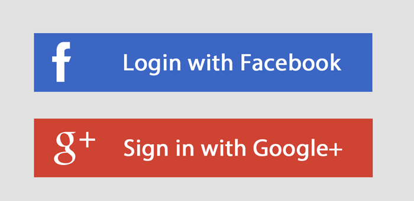

class: center, middle

# JavaScript
## Identification via plateformes tierces

.col-33pct[&nbsp;]
.col-33pct[
  
]

---
class: center, middle, dbl-size
# 🎯 Objectifs

+ Identification tierce ?
+ Intégrer un bouton de login
+ Gérer l'état

---
class: center, middle, dbl-size
# Pré-requis

+ Compte Google EEMI
+ Définition et appel de fonctions

---
class: center, middle, dbl-size
# 🗒️ Plan du cours

1. Principe
2. Pratique
  + Google Sign-in avec app et clé fournies

--
3. Exercice
  + Mise en production
  + Accès limité
  + *Bonus: Facebook Connect*

---
# Ce que l'utilisateur voit

.center[
  
]

---
# Comment ça marche ?

.center[
  
]

???

as generated from http://bramp.github.io/js-sequence-diagrams/
    App->Facebook: App id + domain
    Facebook->Facebook: Check app
    Facebook->User: Dialog
    User->User: Login
    User->Facebook: Permissions
    Facebook->App: Token + User id + permissions

---
# Comment ça marche ?

.column[
  
]

.column[
- **Domain**: déclaré auprès du tiers
- **App/client id**: "clé" fournie par le tiers
- **Permissions**: droits d'accès accordés à l'app par l'utilisateur
- **Token**: chaine de caractères qui sert de "clé temporaire" pour que l'app échange avec l'API du tiers à propos de l'utilisateur
]

---
class: center, middle, dbl-size
# Pratique: Intégration Google Sign-in (30mn)

- app qui affiche le nom de l'utilisateur quand il est connecté,
- et lui permet de se déconnecter.

=> Cloner et compléter l'app suivante: `https://jsbin.com/haxeqad/edit?html,js,output`

---
# Félicitations !

.pull-right[
  
]

- Vous avez intégré un bouton Google Signin à une application.

- Par contre, vous avez utilisé une clé `CLIENT_ID` que j'ai **créée pour vous**, et qui ne fonctionne que depuis le domaine `jsbin.com`.

- Pour que le login de votre application fonctionne **depuis votre propre URL** sur Internet, vous allez devoir la déclarer auprès de Google et configurer votre propre clé `CLIENT_ID`.

---
# Exercice: Login en production (45mn)

1. Héberger le code précédent sur votre espace étudiant, observer l'erreur obtenue
2. Se connecter à la [Console Google Developers](https://console.developers.google.com/project/_/apiui/apis/library) avec son compte EEMI
3. Créer un projet, et moyen de s'identifier à votre application Web avec "OAuth", depuis le domaine où elle est hébergée
4. Intégrer la clé `CLIENT_ID` fournie dans votre page HTML, puis tester la connexion et déconnexion.
5. BONUS: restreindre l'accès qu'à certaines personnes.
6. BONUS: Refaire l'exercice avec Facebook Connect au lieu de Google Signin.

???

référence principale:
- https://developers.google.com/identity/sign-in/web/devconsole-project

autres références:
- http://android-developers.blogspot.fr/2016/03/registering-oauth-clients-for-google.html
- https://developers.google.com/+/web/signin/#enable_the_google_api

---
class: dbl-size
# Félicitations !

.pull-right[
  
]

- Vous êtes maintenant capables de créer des applications web avec login Google !
