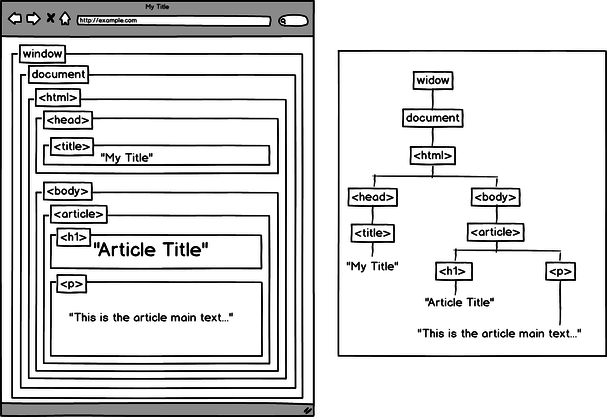

class: center, middle

# JavaScript
.col-33pct[&nbsp;]
.col-33pct[
  
]

---
class: center, middle, dbl-size
# 🎯 Objectifs

+ Comprendre la logique d'usage de jQuery
+ Intérpréter un composant jQuery
+ Convertir du code jQuery code JS DOM natif

---
class: center, middle, dbl-size
# 👌 Pré-requis

+ Savoir créer et tester une page HTML avec du code JS
+ Savoir utiliser jsfiddle

---
class: center, middle, dbl-size
# 🗒️ Plan du TP

- Explication des bases
- Mise en pratique: (30mn)
    + Convertir un composant jQuery simple en JS/DOM natif
- Exercice: (par groupe de projet)
    + Convertir un autre composant jQuery en JS/DOM natif

---
# Rappel: le DOM

.center[
  
]

---
# Le DOM, JavaScript et jQuery

.center[
  
]

- **DOM**: structure d'une page HTML chargée dans le navigateur
--

- **DOM API**: fonctions permettant de manipuler le DOM
--

- **JavaScript**: langage permettant d'utiliser des APIs depuis le navigateur
--

- **jQuery**: bibliothèque JavaScript fournissant des raccourcis pour manipuler le DOM

---
class: center, middle
# Sélecteurs / structure

jQuery                      | ↔ | JavaScript/DOM
--------------------------- | - | ---------------------------
`$('#monDiv')`              |   | `document.getElementById('monDiv')`
`$('.maClasse')`            |   | `document.getElementsByClassName('maClasse')`
`$('
')`    |   | `createElement()` + `setAttribute()`
`$('#monDiv').append(html)` |   | `<el>.appendChild(node)` / `innerHTML`

---
class: center, middle
# Accesseurs / modifieurs

jQuery                      | ↔ | JavaScript/DOM
--------------------------- | - | ---------------------------
`$('#monInput').val()` | | `document.getElementById('monInput').value`
`$('#monLien').attr('href', url)` | | `<el>.setAttribute('href', url)`
`$('#monDiv').css('color', 'red')` | | `<el>.style.color = 'red';`

---
class: center, middle
## Propriétés intéressantes

- Boucles: `$('.maClasse').click(fct)`
- Chaînage: `$('#monDiv').click(fct).addClass(cls).append(html);`

--

## Événements

- `$('#monDiv').click(fonction)` ↔ `<el>.onclick = fonction`

--

## Bonus

- `$.ajax(url, fct)` = appel Ajax

---
class: center, middle, dbl-size
# Mise en pratique: jQuery -> JS/DOM Natif

- Tester et analyser le [jsfiddle d'exemple](http://jsfiddle.net/adrienjoly/kfev26f3/)
- Forker ce jsfiddle, puis le modifier pour qu'il ne contienne plus de jQuery:
  1. Fonction associée au clic sur *un seul* menu
  2. ... puis sur *chaque* menu (à l'aide d'une boucle)
  3. Cacher les éléments `.content`
  4. Afficher l'élément `.content` du `.menu` qui a été cliqué

---
class: center, middle, dbl-size
# Exercice: convertir un composant jQuery

## Exemples de composants

- Slider: [Simple Slider](http://www.webdeveloperjuice.com/2010/01/12/lightest-jquery-content-slider-ever-made-380-bytes/) ou [Craftyslide](http://projects.craftedpixelz.co.uk/craftyslide/)
- Nombre animé: [codepen](http://codepen.io/shivasurya/pen/FatiB), [jsfiddle](http://jsfiddle.net/4v2wK/), ou [github](https://github.com/talmand/jquery-animate-numbers)

## Pour vous aider

- [Some jQuery Functions And Their JavaScript Equivalents](http://callmenick.com/post/jquery-functions-javascript-equivalents)
- [Plain JS](https://plainjs.com/javascript/)
