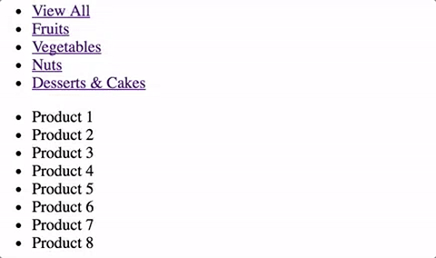

# Chapitre 5: Manipuler les classes et styles CSS

Objectifs:

- Utiliser JavaScript pour manipuler le contenu et l'apparence de pages Web
- Développer une liste avec filtrage dynamique par catégorie
- Comprendre la portée des variables en JavaScript

Plan du chapitre:

1. Manipulation de classes CSS
  - Application: Afficher/cacher
2. Accéder à des éléments par classe
  - Application: Cacher les spoilers
3. Manipulation de styles CSS
  - Application: Surbrillance au clic
  - Exercice: Filtrage par catégorie
4. Accéder à des éléments par nom d'élément
5. Manipulation d'attributs
6. Manipulation de contenu HTML d'un élément
7. Scope et génération de fonctions

---

## 1. Manipulation de classes CSS

En HTML, chaque élément peut être associé à des classes. On les spécifie en les énumérant dans l'attribut `class` de l'élément.

Exemple:

```html
<p id="premier">texte visible</p>
<p id="second" class="hidden">ce texte devrait être caché</p>
```

Dans cet exemple, l'élément `<p>` est associé à une classe `hidden`. Pour que tous les éléments associés à cette classe soient cachés, il suffirait alors de définir la règle CSS suivante:

```css
.hidden {
  display: none;
}
```

En JavaScript, il est possible de modifier dynamiquement la liste de classes associées à un élément (et donc son affichage, en fonction des règles CSS qui sont associées à ces classes), grâce à la propriété [`classList`](https://developer.mozilla.org/fr/docs/Web/API/Element/classList), et à ses fonctions `add()` et `remove()`.

Exemple:

```js
var element = document.getElementById('un-element');
element.classList.add('hidden'); // => la classe hidden va être associée à l'élément
```

### Exercice: Afficher/cacher

- Créer une page web valide contenant les deux paragraphes `<p>` tels que définis plus haut.
- Y associer un fichier CSS contenant la règle `.hidden` tel que définie plus haut.
- Ouvrir la page, vérifier que seul le premier paragraphe est visible.
- Quel code JavaScript faut-il exécuter pour retirer la classe `hidden` du deuxième paragraphe ?

> Solution: [Codepen](http://codepen.io/adrienjoly/pen/pRaBYd)

<!--
Solution:

document.getElementById('second').classList.remove('hidden');
-->

---

## 2. Accéder à des éléments par classe

Dans la partie précédente, nous avons utilisé la fonction `getElementById()` pour accéder à un des éléments de notre page, à partir de son identifiant `id`.

L'API du DOM donne également accès à une fonction qui permet d'accéder à l'ensemble des éléments qui portent une même classe `class`: `getElementsByClassName()`.

Supposons que nous soyons sur une page HTML contenant plusieurs paragraphes portant une même classe:

```html
<p>C'est l'histoire d'un garçon troublé</p>
<p class="spoiler">car il s'avère que son ours en peluche a disparu</p>
<p class="spoiler">mais finalement il le retrouve</p>
```

Pour accéder à tous les éléments portant la classe `spoiler`, nous allons utiliser le code JavaScript suivant:

```js
var elements = document.getElementsByClassName('spoiler'); // => tableau d'éléments
```

À noter que, contrairement à `getElementById()`, cette fonction ne retourne pas un seul élément, mais un tableau de plusieurs éléments.

Pour effectuer une même manipulation sur chacun des éléments de ce tableau, il suffit d'utiliser une boucle `for`, tel que nous l'avons vu dans un précédent chapitre.

### Exercice: Cacher les spoilers

- Créer une page web valide contenant les trois paragraphes `<p>` tels que définis dans l'exemple ci-dessus.
- Y associer un fichier CSS contenant la règle `.hidden` tel que définie plus haut.
- Ouvrir la page, vérifier que les trois paragraphes sont visibles.
- Quel code JavaScript faut-il exécuter pour ajouter la classe `hidden` aux paragraphes qui portent la classe `spoiler` ?
- Ajouter un bouton à la page HTML, et y intégrer le code JS nécessaire pour que les spoilers soient cachés seulement une fois que l'utilisateur aura cliqué sur le bouton.

> Attention, aucun code JavaScript ne doit pas apparaître dans votre fichier HTML => faire un fichier .js à part.

> Solution: [Codepen](http://codepen.io/adrienjoly/pen/WRMWWO)

<!--
Solution:

var tab = document.getElementsByClassName('spoiler');

document.getElementById('mon-bouton').onclick = function() {
  for (var i=0; i<tab.length; i++) {
    tab[i].classList.add('hidden');
  }
};
-->

---

## 3. Manipulation de styles CSS

Nous savons à présent:

- accéder à des éléments HTML, à partir de leur `id` ou `class`;
- et modifier la liste des classes associées à un élément HTML.

Dans cette partie, nous allons voir qu'il est possible de modifier dynamiquement le style d'éléments HTML sans avoir à manipuler de classes CSS.

De la même manière que les éléments HTML `<input>` fournissent une propriété JavaScript `value` permettant d'accéder à leur valeur, tous les éléments HTML fournissent une propriété JavaScript `style`.

Alors que la propriété `value` est de type `String` (chaîne de caractères), la propriété `style` est de type `Object`.

L'objet associé à la propriété `style` est structuré similairement à une règle CSS: il est constitué de propriétés clé-valeur.

Exemple de règle CSS:

```css
#mon-element {
  border: 1 solid black;
  background-color: red;
}
```

... et l'objet JavaScript correspondant, tel qu'associé à la propriété `style` de l'élément:

```js
{
  border: '1 solid black',
  backgroundColor: 'red'
}
```

Il y a deux **différences importantes** à noter:

- la propriété `style` de l'élément doit respecter la syntaxe d'objet JavaScript (JSON), donc les valeurs de propriétés sont des chaînes de caractères (entre apostrophes), et les propriétés doivent être séparées par des virgules (au lieu des point-virgules de la notation CSS);
- enfin, les noms de propriétés contenant des tirets doivent être écris en respectant la notation "camel case" (pour rappel: mots collés, avec majuscules en début de chaque mot sauf le premier).

### Exemple de changement de style

Prenons le fichier HTML suivant:

```html
<p id="premier">texte important</p>
<p id="second">autre texte</p>
```

Pour modifier la couleur de fond du premier paragraphe, il faut exécuter le code JavaScript suivant:

```js
var element = document.getElementById('premier');
element.style.backgroundColor = 'red';
```

### Exercice: Surbrillance au clic

- Créer une page web valide contenant les deux paragraphes `<p>` tels que définis dans l'exemple ci-dessus.
- Ouvrir la page, vérifier que les deux paragraphes sont visibles.
- Intégrer le code JavaScript nécessaire pour que la couleur de fond du deuxième paragraphe devienne jaune quand l'utilisateur clique dessus.
- Bonus: Intégrer le code JavaScript nécessaire pour que la couleur de fond de n'importe quel paragraphe de la page devienne jaune quand l'utilisateur clique dessus. (indice: il va falloir utiliser le paramètre fourni à l'appel de votre fonction `onclick`, nous ne l'avons pas encore vu en cours)

> Solution: [Codepen](http://codepen.io/adrienjoly/pen/BpYEgQ?editors=1010#0) (et [bonus](http://codepen.io/adrienjoly/pen/JEpVgV?editors=1010#0))

<!--
Solution:

var element = document.getElementById('second');

element.onclick = function() {
  element.style.backgroundColor = 'yellow';
};
-->

### Exercice à rendre: Filtrage par catégorie

Vous allez développer une page web contenant une liste de produits, et permettant à l'utilisateur de filtrer l'affichage de ces produits, en activant les catégories de produits qui l'intéressent.

Exemple minimaliste (animation):



Vous êtes libre sur le choix des produits et des catégories qui seront proposés sur votre page, sur leur rendu visuel, ainsi que sur la manière d'activer les catégories.

Contraintes à respecter:

- incluez au minimum 10 produits et 3 catégories;
- chaque produit doit être représenté par un élément HTML;
- les catégories de chaque produit doivent associées aux éléments correspondants à l'aide de l'attribut `class`;
- le filtrage par catégories doit s'appuyer sur ces classes;
- l'utilisateur doit pouvoir passer rapidement d'une catégorie à une autre, puis afficher la liste complète (non filtrée) des produits;
- au moins 2 de vos produits doivent être présents dans plusieurs catégories.

Exemple de liste de produits en HTML:

```html
<article class="ludique pratique">iPad</article>
<article class="ludique sportif">Batte de baseball</article>
<article class="pratique">Ventilateur</article>
```

Vous serez évalué(e) selon les critères suivants:

- bon fonctionnement du filtrage,
- concision et qualité du code,
- bonus: esthétique du rendu et simplicité d'usage. (ergonomie)

Les solutions les plus élégantes seront présentées en cours.

> Solution: [Codepen](http://codepen.io/adrienjoly/pen/ggNNba)

---

## 4. Accéder à des éléments par nom d'élément

### Fonction DOM: `getElementsByClassName()`

Jusqu'ici, nous avons vu deux fonctions de sélection d'éléments du DOM:

- `getElementById()` retourne un élément, quand on fournit son `id`;
- et `getElementsByClassName()` retourne un tableau d'éléments, quand on fournit leur `class`.

Dans certains cas, il est pratique d'adresser les éléments par type (nom de balise). C'est ce que permet la fonction `getElementsByTagName()`.

Exemple:

```js
var images = document.getElementsByTagName('img');
// => images est un tableau contenant tous les éléments  de la page
```

À noter que, comme `getElementsByClassName()`, `getElementsByTagName()` retourne un tableau d'éléments.

--

## 5. Manipulation d'attributs

### Fonctions DOM: `getAttribute()` et `setAttribute()`

Nous avons vu qu'il était possible de récupérer et/ou modifier la valeur d'un champ `<input>` à l'aide de la propriété `value` de l'objet JavaScript représentant ce champ.

Il se trouve que `value` est aussi le nom de l'attribut HTML correspondant. En effet, le DOM donne accès à des propriétés correspondant aux attributs standards des éléments HTML.

En guise d'exemple, imaginons l'élément HTML suivant:

```html
<button id="mon-bouton" data-numero="5">
```

L'attribut `data-numero` n'est pas standard, mais nous avons le droit de nous en servir pour rattacher des informations à cet élément.

Pour récupérer la valeur de cet attribut, utilisons la fonction `getAttribute()` de la manière suivante:

```js
document.getElementById('mon-bouton').getAttribute('data-numero');
// => cet appel de fonction retournera 5
```

Pour modifier la valeur de cet attribut, utilisons la fonction `setAttribute()` de la manière suivante:

```js
document.getElementById('mon-bouton').setAttribute('data-numero', 7);
// => l'attribut va prendre la valeur 7, au lieu de 5
```

---

## 6. Manipulation de contenu HTML d'un élément

### Propriété `innerHTML`

Avant que nous décrivions comment modifier la structure du DOM d'une page web, sachez qu'il est possible de modifier directement depuis JavaScript le code HTML contenu par un élément HTML: à l'aide de la propriété `innerHTML` de cet élément.

Exemple:

```html
<!-- Avant: -->
<p id="mon-parag">texte initial</p>
```

```js
document.getElementById('mon-parag').innerHTML = 'image: ';
```

Cette affectation modifiera le DOM de la page web de la manière suivante:

```html
<!-- Après: -->
<p id="mon-parag">image: </p>
```

---

## 7. Scope et génération de fonctions

Nous avons vu plus haut qu'il fallait utiliser une boucle `for` pour effectuer une même opération sur un ensemble d'éléments HTML.

Exemple:

```js
// supposons que elements soit un tableau d'éléments HTML
for (var i = 0; i < elements.length; i++) {
  elements[i].classList.add('bordure-rouge');
}
```

Ce genre de code ne pose aucun problème.

Par contre, dès qu'une boucle `for` définit une fonction qui sera appelée plus tard et dépend de la variable de boucle, notre programme se comporte de manière inattendue...

C'est notamment le cas si on définit une fonction `onclick` dans une boucle, tel que dans l'exemple suivant:

```js
// supposons que elements soit un tableau d'éléments HTML
for (var i = 0; i < elements.length; i++) {
  elements[i].onclick = function() {
    alert('vous avez cliqué sur l\'élément nº' + i);
  }
}
```

En cliquant sur les éléments sur lesquels s'applique cette boucle, vous constaterez que l'`alert` affichera toujours le même élément, alors que la variable de boucle `i` prend bien comme valeur l'indice de chaque élément de la page.

Ce comportement est dû à la manière dont JavaScript référence les variables: leur "portée" (appelée "scope", en Anglais).

### "Scope": portée des variables

**En JavaScript, toute variable définie par `var` est rattachée à la fonction qui contient sa définition, ou dans l'espace "global" sinon.**

Illustration:

```js
var variableGlobale = 4;
function maFonction() {
  var variableLocale = 5;
  console.log('(maFonction) variableGlobale:', variableGlobale); // => 4
  console.log('(maFonction) variableLocale:', variableLocale);   // => 5
}
maFonction();
console.log('variableGlobale:', variableGlobale); // => 4
console.log('variableLocale:', variableLocale);   // => ReferenceError: variableLocale is not defined
```

Quand on mentionne une variable à l'intérieur d'une définition de fonction, JavaScript va d'abord chercher s'il existe une variable localement définie, puis chercher dans les contextes parents dans lesquels ont été définis cette fonction, jusqu'à l'espace global, si besoin.

Dans le cas de notre boucle `for` (cf exemple plus haut), la fonction affectée à la propriété `onclick` utilise la variable `i`, et cette variable n'est pas locale à cette fonction: elle est rattachée au contexte parent (celui qui contient la définition de fonction).

Du coup, lorsque cette fonction est appelée (en l’occurrence: au moment où l'utilisateur clique sur un élément), c'est la valeur de cette variable *au moment de l'appel* qui va être utilisée. Or, au moment de l'appel, notre boucle a fini d'itérer, et la variable `i` vaut donc sa valeur maximum. (en l’occurrence: `elements.length`)

Pour éviter ce problème de portée, le plus simple est d'appeler à chaque itération une fonction en passant notre variable `i` en paramètre, de manière à ce que sa valeur soit rattachée à la fonction (comme si c'était une variable locale), et non au contexte parent.

Il existe deux moyens classiques d'appliquer cette pratique:

1. la **closure**: définir une fonction anonyme et l'appeler dans la foulée;
2. ou appeler une fonction qu'on aura définie à l'extérieur de notre boucle.

Dans les deux cas, cette fonction devra retourner une autre fonction, de manière à ce que cette dernière ne soit pas appelée immédiatement au moment de la définition de la fonction parente.

### Fonction génératrice de fonction

Nous avons vu qu'une fonction pouvait retourner une valeur de n'importe quel type, et que les fonctions étaient un des types avancés du langage JavaScript. Il est donc tout à fait possible qu'une fonction retourne une autre fonction !

Exemple:

```js
function mere() {
  console.log('fonction mere appelée');
  return function fille() {
    console.log('fonction fille appelée');
  };
}
var fct = mere(); // => affiche 'fonction mere appelée' puis retourne la fonction fille
// => la fonction fille est affectée à la variable fct
fct(); // => affiche 'fonction fille appelée'
```

Pour éviter le problème de portée expliqué plus haut, il suffit alors de passer la valeur en paramètre de la fonction mère, qui sera appelée à chaque itération de la boucle:

```js
function mere(i) {
  // i est *promue* comme variable locale à la fonction mere
  // => à chaque appel de la fonction qu'elle retourne, elle aura conservé sa valeur
  return function fille() {
    alert('vous avez cliqué sur l\'élément nº' + i);
    // i fait référence à la valeur qui avait été passée en paramètre
    // de l'appel à la fonction mere(), à chaque itération de boucle.
  };
}
// supposons que elements soit un tableau d'éléments HTML
for (var i = 0; i < elements.length; i++) {
  elements[i].onclick = mere(i);
  // => la fonction retournée par mere va être affecté à fille
}
```
