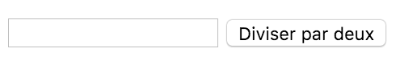
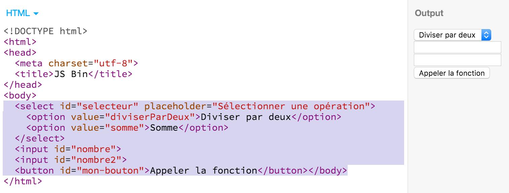

# TP E: Fonctions et formulaires dynamiques

Plan du cours:

- Javascript Awesomeness: [Multiphase flow](http://codepen.io/tholman/pen/LCaHB)
- Correction du [QCM D](https://docs.google.com/forms/d/1vS_brLFhQHrc5cudOG89UHJVlffSXgNDZeSvu-bvx50/edit?usp=drive_web)
- Présentation du partiel à venir
- Pratique: Usage de jsfiddle et upload HTML+Javascript sur FTP
- Théorie: Les fonctions en Javascript, et comment les tester
- Pratique: Exercices
- Devoir: Finir les exercices et les envoyer sur FTP (noté)

### Introduction

Comme en mathématiques, une fonction Javascript est une opération transformant des paramètres (en "entrée") en une valeur de résultat (la "sortie").

"]
    param -> func [label="paramètres en entrée"]
    func [shape=box,label="fonction \(code\)"]
    func -> res [label="résultat en sortie"]
    res [label="valeur"]
  }
)

Définir une fonction sert à regrouper des instructions Javascript, afin qu'elles puissent être exécutées à différentes occasions, sans avoir à répéter le code correspondant.

Dans le contexte d'un navigateur web, les fonctions sont utilisées par le développeur pour définir le comportement que doit suivre le navigateur lorsque l'utilisateur effectue certaines actions (ex: saisie dans un champ, clic sur un bouton, soumission d'un formulaire). Les fonctions sont donc essentielles aux formulaires dynamiques, dont le fonctionnement dépend de la saisie de l'utilisateur.

"]
    func -> res [label="résultat \(non requis\)"]
    res [label="valeur"]
  }
)

### Définition et appel de fonction

On définit une fonction de la manière suivante:

```
function nom_de_la_fonction (parametre_1, parametre_2, parametre_3 ...) {
  // instructions javascript
  return resultat;
}
```

Par exemple:

```
function multiplierParDeux (nombre) {
  return nombre * 2;
}
```

Pour exécuter une fonction, il faut "l'appeler" en citant son nom, et en lui fournissant les valeurs des paramètres entre parenthèses.

Par exemple:


```
var resultat = multiplierParDeux(3); // => le paramètre nombre vaut 3 => la variable resultat vaut 6
```

Comme pour une variable, l'appel à une fonction peut être remplacé dans le code par la valeur qu'elle renvoie. Contrairement aux variables, cette valeur dépendra de la valeur des paramètres passés à la fonction.

Ainsi, il est possible de passer le résultat de l'appel d'une fonction en paramètre d'une fonction.

Exemple de substitution d'un appel de fonction par sa valeur de retour:


```
var resultat = multiplierParDeux(multiplierParDeux(3)); // équivaut à:
var resultat = multiplierParDeux(3 * 2); // qui équivaut à:
var resultat = (3 * 2) * 2; // qui vaut finalement:
var resultat = 12;
```

Et, avec une autre valeur passée en paramètre:

```
var resultat = multiplierParDeux(multiplierParDeux(4)); // équivaut à:
var resultat = multiplierParDeux(4 * 2); // qui équivaut à:
var resultat = (4 * 2) * 2; // qui vaut finalement:
var resultat = 16;
```

### Utilisation de fonctions dans un navigateur web

Dans un navigateur web, le code Javascript peut interagir avec la structure de la page web dans laquelle il s'exécute: le DOM.

Les fonctions peuvent donc être définies pour être appelées en réponse à une action de l'utilisateur (un "événement") sur un ou plusieurs éléments de cette page web.

Par exemple, imaginons une page web contenant un bouton dont l'`id` est `mon-bouton`. Le code Javascript suivant affichera une alerte modale à chaque fois que l'utilisateur cliquera sur ce bouton:

```
document.getElementById('mon-bouton').onclick = function(evt) {
  alert('vous avez cliqué!');
};
```

À noter que dans cet exemple:
- `getElementById` est une fonction, car on lui passe un paramètre entre parenthèses (l'`id` du bouton, en l’occurrence). L'appel à cette fonction retourne un élément du DOM.
- `alert` est aussi une fonction.
- La fonction que nous définissons à droite de l'affectation `=` n'a pas de nom. C'est ce qu'on appelle une fonction anonyme. Elle sera appelée par le navigateur, à chaque fois que l'utilisateur cliquera sur le bouton auquel elle a été rattachée.
- La fonction que nous définissons ne contient pas de `return`. Par conséquent, sa valeur de retour est `null`. Ceci n'a pas d'importance dans notre cas, car cette fonction sert seulement à définir un comportement définie par une liste d'instructions Javascript, et non à retourner une valeur.
- La valeur du paramètre `evt` sera fournie par le navigateur lors de son appel. La valeur de ce paramètre contient notamment le type d’événement qui a déclenché l'appel de cette fonction (en l'occurrence: `click`), et une référence de l'élément sur lequel cet événement à eu lieu (en l'occurrence: le bouton).
- La valeur du paramètre `evt` contient aussi une fonction `preventDefault()` qui permet d'empêcher le navigateur d'exécuter le comportement par défaut pour cette action.

### Valeur et affectation d'une fonction

Nous avons vu que l'appel d'une fonction consiste à mentionner son nom, suivi de paramètres exprimés entre parenthèses. Et que cet appel est remplacé par la valeur retournée par son exécution. Ainsi, `multiplierParDeux(3)` est remplacé par sa valeur de retour: `6`, après l'exécution de la fonction `multiplierParDeux` à laquelle on a passé la valeur `3` en paramètre.

Pour rappel, une variable Javascript est remplacée par la dernière valeur qui lui a été affectée. Ainsi, si la valeur `6` a été affectée à la variable `maVariable` à l'aide de l'instruction `maVariable = 6;`, les mentions suivantes de `maVariable` seront remplacée par sa valeur `6`.

En Javascript, une fonction est une valeur, au même titre qu'une valeur décimale ou une chaîne de caractères. Elle peut donc aussi être attribuée à une variable.

Ainsi il est possible d'affecter la fonction `multiplierParDeux` à la variable `maVariable`:

```
maVariable = multiplierParDeux;
```

...et de l'appeler de la manière suivante:

```
maVariable(3); // => retourne la valeur 6;
```

Il est donc aussi possible d'affecter une fonction anonyme à une variable:

```
var multiplierParTrois = function (nombre) {
  return nombre * 3;
};
```

... ce qui est équivalent à:

```
function multiplierParTrois (nombre) {
  return nombre * 3;
}
```

C'est d'ailleurs ce type d'affectation (de fonction anonyme) qui permet de définir des comportements aux événements du DOM. Pour rappel:

```
document.getElementById('mon-bouton').onclick = function(evt) {
  alert('vous avez cliqué!');
};
```

En effet, ce comportement aurait aussi pu être défini de la manière suivante:

```
function afficherAlerteModale (evt) {
  alert('vous avez cliqué!');
};
document.getElementById('mon-bouton').onclick = afficherAlerteModale;
```

### Bugs et tests unitaires: comment tester une fonction

Appeler une fonction ajoute de l'incertitude et parfois de l'imprévisibilité au comportement du code, car cela revient à déléguer une fonctionnalité à une autre partie du code (la définition de la fonction appelée).

Afin de se rassurer sur le bon fonctionnement d'une fonction et éviter les "bugs", il est important de tester les fonctions qu'on utilise.

Un "bug" est un comportement imprévu causant des anomalies et/ou l'interruption de l'exécution du programme. Il est généralement causé par une erreur d'implémentation ou une réalisation trop naïve (c.a.d. ne couvrant pas certains cas qui peuvent se produire).

Exemple d'implémentation naïve pouvant causer un bug:

```
function multiplierParDix (nombre) {
  return nombre + "0"; // on ajoute un zéro à la fin du nombre
}
multiplierParDix(2) == 20; // => ok
multiplierParDix(3) == 30; // => ok
multiplierParDix(0.5) == 0.50; // => BUG! on aurait du obtenir 5 dans ce cas
```


Dans l'exemple ci-dessus, nous avons saisi trois tests unitaires pour notre fonction `multiplierParDix`, et l'un deux nous a permis de détecter un bug dans notre fonction.

À retenir: Un test unitaire consiste à vérifier qu'une fonction se comporte comme prévu dans un cas donné, en comparant le résultat retourné au résultat qui aurait du être retourné, pour chaque cas testé.

Afin de réduire le nombre de bugs potentiels d'une fonction, et donc de se rassurer sur son bon fonctionnement, il faut écrire et exécuter plusieurs tests unitaires, et penser intelligemment aux "cas limites", les cas qui pourraient le plus probablement causer un bug.

## Mise en pratique 1

Dans cette partie de mise en pratique, nous allons développer ensemble plusieurs fonctions, et les tester.

Sachant que le code que nous allons utiliser est du pur Javascript sans aucune dépendance au DOM, nous pouvons saisir et tester nos fonctions dans n'importe quel interpréteur Javascript. Par exemple:
la console Javascript de notre navigateur web (cf TP A);
un fichier .js rattaché à un fichier .html ouvert dans notre navigateur web (cf TP B);
sur un site comme codepen, jsfiddle ou jsbin;
ou à l'aide de l'interpréteur `node` à appeler depuis le terminal de votre système d'exploitation.

Développer:
- une fonction `diviserParDeux` qui retourne la moitié de la valeur passée en paramètre. Tests:
  - `diviserParDeux(2) == 1`
  - `diviserParDeux(4) == 2`
  - `var n = Math.radom(); diviserParDeux(n) == n / 2`
- une fonction `somme` qui retourne la somme des deux paramètres qui lui seront passés. Tests:
  - `somme(1, 1) == 2`
  - `somme(1, 2) == 3`
  - `somme(2, 1) == 3`
  - `var n = Math.radom(); somme(n, 1) == n + 1`
- une fonction `signe` qui retourne la chaine de caractères `positif`, `négatif` ou `nul`, selon le signe de la valeur passée en paramètre. Tests:
  - `signe(-1) == 'negatif'`
  - `signe(0) == 'nul'`
  - `signe(Math.radom()) == 'positif'`
- une fonction `factorielle` qui retourne le produit des entiers entre 1 et l'entier passé en paramètre. Exemple: `factorielle(3)` retourne le résultat de `1 * 2 * 3`, soit `6`. Tests:
  - `factorielle(0) == 0`
  - `factorielle(1) == 1`
  - `factorielle(3) == 6`
  - `factorielle(4) == 24`

Remarque: la fonction `Math.random()` renvoie un nombre décimal aléatoirement choisi entre 0 et 1. L'utilisation de cette fonction dans les tests permet d'assurer que votre fonction ne gère pas certains cas "en dur" dans le code. (c.a.d. avec un `return` par condition `if`, vérifiant plusieurs valeurs prédéfinies des paramètres)

## Exercice 1 - formulaire simple

Dans cet exercice, nous allons rattacher les fonctions écrites ci-dessus à des événements de formulaire web. Nous allons donc utiliser le DOM, et tester depuis un navigateur web.

Voici le code du formulaire:

```
<input id="nombre">
<button id="mon-bouton">Diviser par deux</button>
```



1. Écrire le code Javascript permettant d'afficher dans une alerte modale le résultat de la division par 2 du nombre saisi par l'utilisateur dans le champ (dont l'`id` est `nombre`), à chaque fois que l'utilisateur cliquera sur le bouton (dont l'`id` est `mon-bouton`). Votre code ne doit pas effectuer directement de division, par contre vous pouvez utiliser la fonction `diviserParDeux` définie plus haut.

2. Modifier votre code de manière à ce qu'une alerte modale affiche "veuillez saisir un nombre", dans le cas où le champ serait vide au moment où l'utilisateur clique sur le bouton.

3. Uploader vos fichiers HTML et Javascript en FTP, de manière à ce que votre formulaire soit testable directement depuis le répertoire `/cours-javascript/tp-e/ex-1/` de votre espace web EEMI. C'est depuis ce répertoire que votre travail sera évalué, pour compléter votre note de controle continu.

## Exercice 2 - formulaire dynamique

Dans cet exercice, nous allons modifier un formulaire dynamiquement, c'est à dire que celui-ci va évoluer en fonction de la saisie de l'utilisateur.

Le formulaire permettra de diviser par deux un nombre saisi par l'utilisateur, et de calculer la somme de deux nombres saisis par l'utilisateur. Dans le premier cas, seul un champ de saisie est nécéssaire. Dans le deuxième cas, deux champs sont nécéssaires. Et nous allons ajouter un composant de sélection, afin que l'utilisateur puisse choisir l'opération qu'il souhaite utiliser. (et la fonction qui sera utilisée pour donner le résultat)

Notre formulaire consiste en trois composants:

- un sélecteur de mode
- un premier champ de saisie
- un second champ de saisie

Voici le code HTML correspondant:

```
<select id="selecteur" placeholder="Sélectionner une opération">
  <option value="diviserParDeux">Diviser par deux</option>
  <option value="somme">Somme</option>
</select>
<input id="nombre">
<input id="nombre2">
<button id="mon-bouton">Appeler la fonction</button>
```



1. Écrire la fonction Javascript `evaluer()` permettant d'afficher une **alerte modale** quand l'utilisateur clique sur `mon-bouton`.

2. Écrire la fonction Javascript `selection()` permettant de **cacher** le champ `nombre2` lorsque l'utilisateur choisit l'option `diviserParDeux`, et de l'afficher lorsque l'utilisateur choisit l'option `somme`. Utilisez la propriété CSS `display` pour cela.

3. Modifier la fonction `evaluer()` pour qu'elle affiche dans une alerte modale la **somme** des valeurs entrées par l'utilisateur dans les champs `nombre` et `nombre2`. 

4. Créer la fonction `somme(a, b)` qui renvoie la somme des deux nombres passés en paramètres. Tester le bon fonctionnement de cette fonction. (cf partie "Mise en pratique 1")

5. Modifier la fonction `evaluer()` de manière à ce qu'elle utilise la fonction `somme()` pour calculer le résultat. Note: vous allez devoir utiliser la fonction `parseFloat()` pour transformer les saisies en nombres.

6. Ajouter la fonction `diviserParDeux()` (cf partie "Mise en pratique 1") dans le fichier Javascript. Tester le bon fonctionnement de cette fonction.

7. Modifier la fonction `evaluer()` pour qu'elle affiche le résultat de la somme des deux nombres saisis, ou de la division par deux, **en fonction de l'opération séléctionnée par l'utilisateur**. Dans le cas où l'utilisateur n'aurait pas sélectionné d'opération, afficher `"choisir une operation"` (*sans accent*) dans l'alerte modale, au lieu du résultat. Sinon, dans le cas où l'utilisateur aurait oublié de saisir un nombre (dans l'un ou l'autre champ de saisie), afficher `"saisir un nombre"` dans l'alerte modale, au lieu du résultat.

8. Uploader vos fichiers HTML et Javascript en FTP, de manière à ce que votre formulaire dynamique soit testable directement depuis le répertoire `/cours-javascript/tp-e/ex-2/` de votre espace web EEMI. C'est depuis ce répertoire que votre travail sera évalué, pour compléter votre note de controle continu.

Contraintes à respecter: 

- Il doit être possible de changer d'opération et de saisies plusieurs fois sans recharger la page.
- A chaque clic sur le bouton, une seule alerte modale doit être affichée, contenant seulement le nombre résultant de l'opération.

## Exercice 3 (optionnel, mais points extra) - formulaire réellement dynamique

Dans l'exercice précédent, l'utilisateur pouvait obtenir le calcul d'une somme de deux termes.

L'objectif de cet exercice est de créer un formulaire permettant de calculer la somme d'une liste dynamique de termes en entrée. C'est à dire que l'utilisateur pourra ajouter autant de champs de saisie qu'il le souhaite.

Pour cela:

- Vous allez initialement afficher deux champs de saisie et un bouton `mon-bouton` pour effectuer la somme des nombres saisis dans ces champs. (similairement à l'exercice précédent)
- Ensuite, vous allez y intégrer un bouton `more`. A chaque clic sur ce bouton, un champ de saisie supplémentaire devra être ajouté dans le formulaire.
- Enfin, vous vous assurerez que la somme retournée par le bouton `mon-bouton` prenne bien en compte les nombres saisis dans tous les champs.

Si vous parvenez à faire fonctionner une telle page depuis le répertoire `/cours-javascript/tp-e/ex-3/` de votre espace web EEMI, vous gagnez 1 point bonus.

Si votre solution utilise une fonction pour effectuer les additions et qu'elle est indépendante du DOM de la page, vous gagnez un 2ème point.
