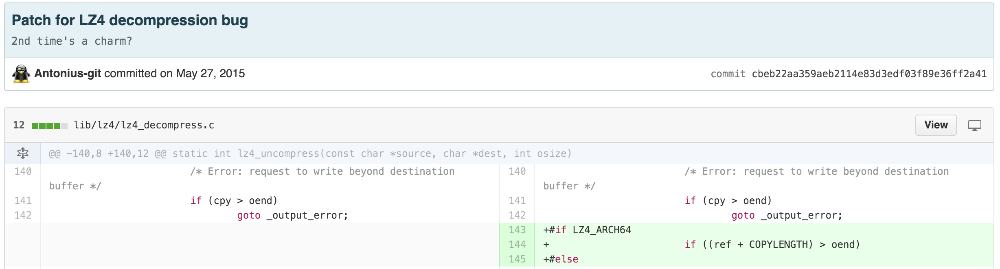
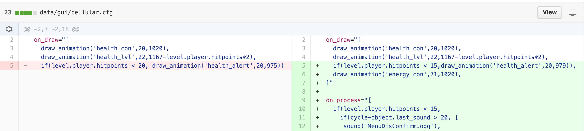
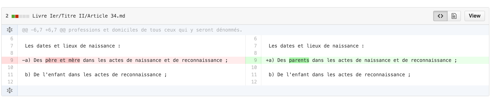
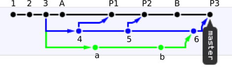

class: center, middle

# Javascript
# TP M
# Git et Github Pages

---

# Javascript - TP M

- Objectifs:
    + Comprendre à quoi sert Git
    + Savoir cloner un projet Git
    + Savoir contribuer à un projet Git
    + Savoir publier une page web sur Github Pages

--

- Programme:
    + Explication des bases
    + Mise en pratique
    + Explications: De git à Github Pages
    + Exercice: Publier votre app TODO-list

---

# Compétences requises

- Installer le logiciel git sur votre machine

- Savoir manipuler des fichiers depuis un terminal/shell

- Lire documentation et exemples en anglais sur internet

- Prendre des notes: [support de cours](https://docs.google.com/a/eemi.com/document/d/1L5uxOTcHf6QdiGqTQxseO2RdvS78kpXPjxfeC6UiPiQ/edit?usp=sharing)

---

# Point commun ?

.col-33pct[]
.col-33pct[]
.col-33pct[]

???

Repos:
- [Linux](https://github.com/torvalds/linux)
- [Frogatto & Friends](https://github.com/frogatto/frogatto)
- [Le Code Civil Français](https://github.com/steeve/france.code-civil)
- Autre: https://github.com/vhf/free-programming-books/blob/master/free-programming-books-fr.md
---

.wide[]
.wide[]
.wide[]

???

Sources:
- [Linux](https://github.com/torvalds/linux/pull/189/commits/cbeb22aa359aeb2114e83d3edf03f89e36ff2a41)
- [Frogatto & Friends](https://github.com/frogatto/frogatto/pull/3/commits/5fac97665843f355616f30f5f2eec8daf55934d4)
- [Le Code Civil Français](https://github.com/steeve/france.code-civil/commit/b805ecf05a86162d149d3d182e04074ecf72c066)

---
class: quote, center, bottom
background-image: url(./img/steeve-morin.jpg)

.blurred-bg[
    ## Git permet non seulement de visionner les sources a un instant T (*snapshot*), mais surtout de visualiser facilement les changements dans ces sources (*commits*).
]

---
class: quote, center, bottom
background-image: url(./img/steeve-morin.jpg)

.blurred-bg[
    # Dans l’analogie du Code Civil, cela permet de tracker très rapidement les changements apportés par une loi.
]

---

# Git, pourquoi faire ?

- Git permet:
    - de collaborer à plusieurs sur un même code source
    - de savoir qui a codé quoi, quand
    - de revenir à une ancienne version du code
    - d'aider à résoudre les modifications conflictuelles

- Git a été conçu pour collaborer sur le noyau open-source de Linux

---

# Git en 4 mots

- **Repository**: espace de stockage du code source: local / remote

- **Commit**: une mise à jour du code source: lignes de code de fichier(s)

- **Index / Staging**: une mise à jour en cours d'assemblage

- **Merge**: combiner des mises à jour

---
background-image: url(./img/git-local-remotes.png)

---

# Mise en pratique (30mn)

0. Installer [`git`](https://git-scm.com/downloads)
1. Cloner le *repo* `https://github.com/adrienjoly/cours-javascript` localement
2. Entrer dans le répertoire `cours-javascript` ainsi créé, à l'aide de la commande `cd`, puis lister les fichiers et répertoires qui y sont contenus à l'aide de la commande `ls`
3. Explorer l'historique du *repository* avec `git log` (presser <kbd>ESPACE</kbd> pour scroller, <kbd>q</kbd> pour quitter)
4. Revenir à une version antérieure (*commit*) du repo, avec `git checkout`
5. Exécuter `ls` à nouveau pour constater que la version en cours contient moins de fichiers
6. Afficher les modifications apportées entre ce *commit* et la dernière version, en utilisant `git diff`
7. Noter vos trouvailles dans le support de cours
8. Pour revenir au commit le plus récent, utiliser `git checkout gh-pages`

---

# De git à Github Pages

- `git` est un outil en ligne de commande
- Github est un site permettant d'héberger ses *repositories* en ligne
- Github permet à plusieurs utilisateurs de collaborer sur un *repo*
- Github Pages permet de publier des pages web hébergées au format HTML dans un repo Github (à condition d'utiliser la branche *gh-pages*)

---

# Exercice 1: Créer un repo git local

0. Aller dans votre répertoire personnel (`cd` sans paramètre), créer un répertoire `todolist` avec la commande `mkdir`, puis y entrer avec la commande `cd`
1. Initialiser un repo local dans ce nouveau répertoire avec `git init`
2. Y copier le fichier `index.html` du TP précédent, vérifiez sa présence avec `ls`
3. Lancer `git status` pour constater que `index.html` n'est pas encore indexé
4. Intégrer ce fichier à l'index avec `git add`
5. Lancer `git status` à nouveau pour constater que `index.html` a bien été indexé
6. Valider et décrire vos modifications avec `git commit -m "mon premier commit"`
7. Vérifier que ce commit apparait bien dans l'historique du repo avec `git log`

---

# Branches ?

.column[
* Un repo git a une structure de graphe
* Par défaut les commits se succèdent sur la branche `master`
* Pour se placer sur le dernier commit d'une branche, il faut taper `git checkout <nom_de_la_branche>`
* Toute branche se base sur un commit
* Une branche peut être *mergée* dans une autre branche
* Github publie les fichiers HTML trouvés dans la branche `gh-pages`
]

.column[
    
]

---

# Exercice 2: Publier l'app TODO-list

1. Créer un compte sur Github
2. Créer un repo public "todolist" sur votre compte Github, sans cocher la case "README.md"
3. Une fois sur la page Github de votre repo, poussez le(s) commit(s) de votre repo local (cf exercice 1) dans votre repo Github, en suivant les instructions proposées:
    - `git remote add` pour associer le repo local au repo Github,
    - puis `git push` pour envoyer vos commits
4. Créer une *branche* "gh-pages" dans votre repo local avec la commande `git checkout -b`
5. Pousser cette branche locale vers celle de votre repo Github, avec `git push origin gh-pages`
6. Vérifier que votre TODO-list s'affiche bien depuis `http://<votre_username>.github.io/todolist`

---

# Exercice 2: Publier l'app TODO-list (suite)

7. Créer un fichier `CONTRIBUTORS.md` contenant votre nom dans votre repo local.
8. Créer et pousser un commit à partir de ce fichiers avec les commandes `git add`, `git commit` (cf exercice 1) puis `git push`
9. Chaque personne de l'équipe va ajouter son nom dans CONTRIBUTORS.md depuis son propre repo local puis pousser son commit sur le repo Github. Pour cela:
    - Le créateur du repo Github doit autoriser les contributions depuis les comptes Github de ses co-équipiers, via l'interface d'administration du repo
    - Chaque co-équipier à son tour va: cloner le repo Github dans son répertoire personnel (cf Mise en pratique), ajouter son nom dans CONTRIBUTORS.md, créér puis pousser un commit pour enregistrer cette modification (cf étape 8)
10. Envoyer l'URL de votre repo Github par email à votre enseignant, avec vos co-équipiers en copie, avant Mardi prochain 8h.
