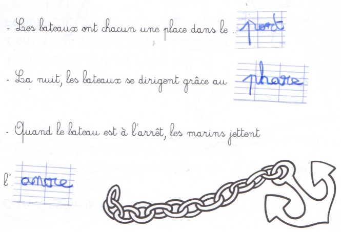
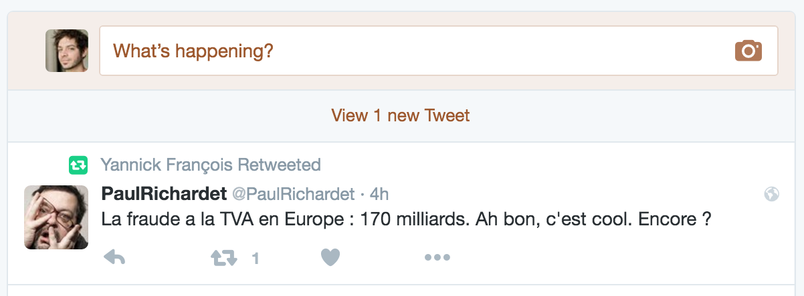
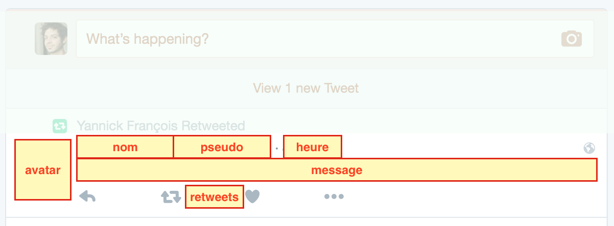

class: center, middle

# Javascript - TP P
# Templates avec Underscore

.col-33pct[&nbsp;]
.col-33pct[
  
]

---

# Javascript - TP P

- Objectifs:
    + Découvrir l'intérêt et l'usage des templates
    + Découvrir Underscore
    + Utiliser Underscore dans notre app de ToDo-list

--

- Exigences:
    + Savoir écrire une app HTML+Javascript dans jsfiddle
    + Maîtriser l'usage des fonctions et chaînes de caractères en Javascript
    + Prendre des notes: [support de cours](https://docs.google.com/a/eemi.com/document/d/1leB4B18p_-ApkVUrUF0p72kZPy3j55taxf_pdzaYh64/edit?usp=sharing)

---

# Programme du TP

- Explication des bases
    + Templating
    + Underscore
- Mise en pratique: (30mn)
    + De la concaténation au templating
- Exercice:
    + Rendu HTML de la ToDo-list avec Underscore

---

# Template = texte à trous

.center[
  
]

---

# Template = texte à trous (paramètres)

.center[
  
]

---

# Template = tweet

.wide[
  
]

---

# Template = tweet (paramètres)

.wide[
  
]

---

# Rendu sans template

```js
div.innerHTML = '<p id="' + key + '">'
    * '<input onclick="cocherTache(\'' + key + '\')" type="checkbox" ' + checked + '">'
    * '<span onclick="supprimerTache(\'' + key + '\')">' + tache.name + '</span>'
    * '</p>';

```

Légende: parties statiques/littérales ("en dur") et dynamiques/variables

## Inconvénients ?

--

- Alternance entre chaînes littérales et dynamiques => confusion
- 2 à 3 niveaux de guillemets !
- Performance CPU non optimale
- Faille de sécurité: code HTML/JS dans parties dynamiques ?
- Mélange du code de "logique" (contrôle) et de "présentation" (rendu)

---

# Principe d'un Template

- Rendu dynamique = template (texte à trous) + paramètres (pour remplir les trous)
--

- Rendu d'un tweet = template (code HTML à trous) + paramètres
--

- `rendu = _.template(monTemplate, param);` => Comment définir `monTemplate` ?
--

```js
var monTemplate = 'Les bateaux ont chacun une place dans le <%= mot %>';
rendu = _.template(monTemplate, { mot: 'port' });
alert(rendu);
```

(cf [jsfiddle](https://jsfiddle.net/adrienjoly/bvyghsau/))

--

- Le template est une chaîne de caractères
- Les parties variables (paramètres) sont mentionnées par identifiant entre `<%=` et `%>`
- La valeur des paramètres est définie dans un objet JSON
- L'appel de la fonction `_.template()` retourne la combinaison du template et des paramètres

---

# Fonction de rendu

Objectif d'usage:

```js
var phrase = rendrePhrase('port');
alert(phrase);
```

--

Définition:

```js
function rendrePhrase(pMot) {
  var monTemplate = 'Les bateaux ont chacun une place dans le <%= mot %>';
  return _.template(monTemplate, { mot: pMot });
}
```

---

# Fonction de rendu - Tweet

.wide[
  
]

Objectif d'usage:

```js
var html = rendreTweet(nom, heure, message, avatarUrl);
monDiv.innerHTML = html;
```

---

# Fonction de rendu - Tweet

.wide[
  
]

Objectif d'usage:

```js
var html = rendreTweet('PaulRichardet', '4h', 'La faute à la TVA...', 'http://photo.jpg');
monDiv.innerHTML = html;
```

---

# Fonction de rendu - Tweet

Objectif d'usage:

```js
var html = rendreTweet('PaulRichardet', '4h', 'La faute à la TVA...', 'http://photo.jpg');
monDiv.innerHTML = html;
```

--

Définition:

```js
function rendreTweet(pseudo, heure, message, avatarUrl) {
  var monTemplate = '<div class="tweet">'
    + '" style="float:left;">'
    + '<p><%= pseudo %> - <%= heure %></p>'
    + '<p><%= message %></p>'
    + '</div>';
  return _.template(monTemplate, {
    pseudo: pseudo,
    heure: heure,
    message: message,
    avatarUrl: avatarUrl
  });
}
```

(cf [jsfiddle](https://jsfiddle.net/adrienjoly/155m4a93/))

---

# Questions à se poser...

- Est-il possible de passer un nombre comme paramètre de template ?
- Condition: comment cacher une partie du template en fonction d'un paramètre ?
- Boucle: comment répéter `n` fois une portion de template ?

**Indice:**

Comme en PHP, il est possible de mélanger code HTML de rendu et code Javascript (instructions de contrôle `if`, `for`...) dans le template.

(chercher des exemples en ligne)

---

# Mise en pratique: concaténation -> template

1. Variable: `bonjour('le monde')` => `<p>Bonjour, le monde !</p>`
2. Opération: `doubler(3)` => `2 * 3 = 6`
3. Condition: `people(1)` => `1 personne`, `people(2)` => `2 personnes`
4. Boucle: `repeter(3)` => `répétition répétition répétition`
5. Boucle avec variable: `repeter(4, 'ok')` => `ok ok ok ok`
6. Tableau: `chiffre(1)` => `un`, `chiffre(2)` => `deux`, ...

**Objectif:**

Pour chaque exemple, écrire la fonction de rendu générant le code HTML indiqué à partir du/des paramètre(s) fourni(s), à l'aide de `_.template()`.

---

# Exercice: Rendu de ToDo-list avec Underscore

- Télécharger [`todolist-initial.html`](https://github.com/adrienjoly/cours-javascript/blob/gh-pages/P/code/todolist-initial.html) puis le renommer `index.html`
- Tester que la ToDo-list fonctionne bien en local depuis votre navigateur
- Suivre une-à-une les instructions `TODO` fournies dans le code
  1. Insérer l'URL de votre propre base de données Firebase (cf TP K-L)
  2. Inclure Underscore dans votre page HTML (cf [recommandations](http://stackoverflow.com/questions/9357806/backbone-js-underscore-js-cdn-recommendation))
  3. Compléter `renderTache()` pour générer le code HTML d'une tâche avec Underscore
  4. Faire en sorte que la checkbox soit cochée si la tâche est terminée
- Publier votre app ToDo-list sur Github Pages
- Améliorer l'expérience utilisateur et le design de votre app
