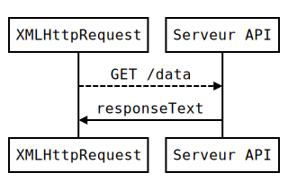

class: center, middle
# JavaScript
## Requêtes AJAX POST 🚀

---
class: center, middle, dbl-size
# 🎯 Objectifs

- Envoyer des données sur le Web, en JS
- Développer un client de *chat*

---
class: center, middle, dbl-size
# 🗒️ Plan du cours

1. Rappels et cours
2. Exercice en binômes

---
class: dbl-size
# Rappels AJAX

- AJAX: requête HTTP(S) depuis JS
- Requête HTTP `GET`: récupérer des données depuis une API
- `JSON.parse()`: transformer `responseText` en objet

---
class: dbl-size
# GET vs POST

- Récupérer des données: HTTP `GET`

.pull-left[
  
]

.comment[
[//]: # ( -- as generated from http://bramp.github.io/js-sequence-diagrams/ -- )
[//]: # (XMLHttpRequest-->Serveur API: GET /data)
[//]: # (Serveur API->XMLHttpRequest: responseText)
]

--

.pull-left[
  
]

.comment[
[//]: # ( -- as generated from http://bramp.github.io/js-sequence-diagrams/ -- )
[//]: # (XMLHttpRequest->Serveur API: POST /data)
[//]: # (Serveur API-->XMLHttpRequest: responseText)
]

- Envoyer des données: HTTP `POST` avec `send(data)`

???

Démo:

- Log du serveur: https://js-ajax-twitter.herokuapp.com/log.html
- Code basé sur formulaire: https://js-ajax-twitter.herokuapp.com/index.html
- URL de l'API: `https://js-ajax-twitter.herokuapp.com/tweet`
- Utilisez l'onglet "Réseau" de Chrome Dev Tools pour tester la requête

---
class: dbl-size
# Requête HTTP POST en AJAX

[//]: # (- Envoi d'une chaine de caractères:)

```javascript
var xhr = new XMLHttpRequest();
xhr.open('POST', 'https://httpbin.org/post');
xhr.onreadystatechange = function() {
  if (xhr.readyState === 4) {
    alert(xhr.responseText);
  }
};
// envoi d'une chaine de caractères:
xhr.send('ceci est un exemple de données envoyées');
```

--
[//]: # (- Envoi d'un objet JavaScript (JSON):)

```javascript
// ... ou envoi d'un objet JSON:
xhr.send(JSON.stringify({ message: 'bonjour!' }));
```

???

- `JSON.stringify()` fait l'opération inverse de `JSON.parse()`
- `JSON.stringify()` transforme un objet JSON en chaine de caractères
- L'API `https://httpbin.org/post` est très pratique pour tester vos requêtes

---
# Exercice: *Tweeter* en AJAX

- Objectif: Faire une requête AJAX POST, au lieu du formulaire.
- Suivre les étapes proposées dans le support de cours.

Pensez à utiliser l'onglet "Réseau" de Chrome Dev Tools pour diagnostiquer.
